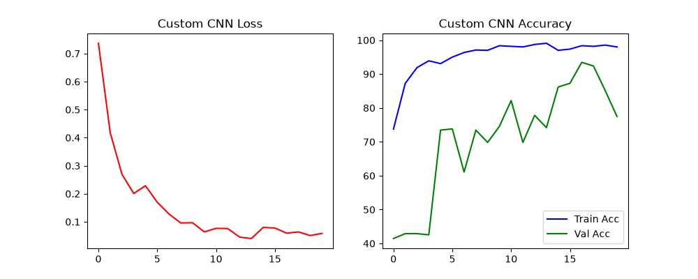
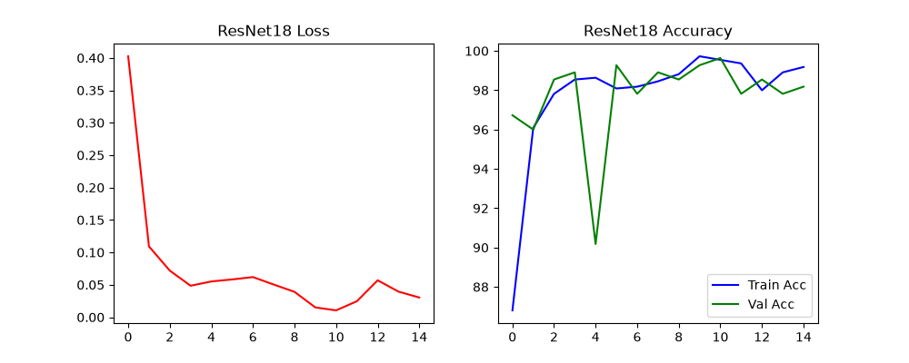

# 🌹 리센느(RESCENE) 멤버 실시간 얼굴 인식 AI 프로젝트
> **PyTorch 기반 엔드투엔드(End-to-End) 얼굴 데이터 수집, 딥러닝 모델 학습 및 모니터 화면 실시간 추론 시스템**

---

## 📌 1. 프로젝트 개요

본 프로젝트는 걸그룹 **리센느(RESCENE)** 멤버들(`woni`, `zena`, `liv`, `minami`, `may`)의 유튜브 영상 데이터로부터 얼굴 이미지를 수집하고, PyTorch 기반의 **커스텀 CNN 모델 및 ResNet18 전이학습(Transfer Learning) 모델을 비교 분석하는 딥러닝 실습 프로젝트**입니다. 수집된 이미지로 두 모델을 각각 학습시킨 후, **PC 모니터 화면에서 재생되는 영상 속 멤버 얼굴을 실시간으로 탐지 및 추론하는 엔드투엔드(End-to-End) AI 시스템**을 구현하였습니다.


---

## 📐 2. 입력 데이터 규격 및 딥러닝 모델 레이어 구조

### 📥 1) 입력 데이터 규격 (Input Shape)
- **입력 텐서 크기**: `(Batch_Size, 3, 224, 224)` (3채널 RGB 컬러 이미지, 224x224 해상도)
- **전처리 정규화 (Normalization)**:
  - ImageNet 표준 평균: `[0.485, 0.456, 0.406]`
  - ImageNet 표준 편차: `[0.229, 0.224, 0.225]`

---

### 🔹 2) 커스텀 CNN 모델 구조 (CustomFaceCNN - `02A_train_custom_cnn.py`)

MiniVGGNet을 확장 개조한 3개의 합성곱(Convolutional) 블록과 전채연결(FC) 분류기로 구성되어 있습니다.

```text
[Input: 3 x 224 x 224]
        │
┌───────┴───────┐
│ Conv Block 1  │  Conv2d(3 -> 32) + BatchNorm + ReLU + Conv2d(32 -> 32) + MaxPool(2x2) + Dropout(0.25)
└───────┬───────┘  --> Output: (32 x 112 x 112)
        │
┌───────┴───────┐
│ Conv Block 2  │  Conv2d(32 -> 64) + BatchNorm + ReLU + MaxPool(2x2) + Dropout(0.3)
└───────┬───────┘  --> Output: (64 x 56 x 56)
        │
┌───────┴───────┐
│ Conv Block 3  │  Conv2d(64 -> 128) + BatchNorm + ReLU + MaxPool(2x2) + Dropout(0.4)
└───────┬───────┘  --> Output: (128 x 28 x 28)
        │
┌───────┴───────┐
│ FC Layers     │  Flatten(100,352) -> Linear(256) -> BatchNorm1d -> Dropout(0.5) -> Linear(num_classes)
└───────────────┘  --> Final Output: (num_classes Logits)
```

| 레이어 (Layer) | 구성 요소 (Operations) | 출력 텐서 모양 (Output Shape) | 파라미터 수 (Param #) |
| :--- | :--- | :--- | :--- |
| **Input** | RGB Image | `(-1, 3, 224, 224)` | 0 |
| **Block 1** | Conv2d(3, 32) + ReLU + BN + Conv2d(32, 32) + MaxPool + Dropout | `(-1, 32, 112, 112)` | 10,240 |
| **Block 2** | Conv2d(32, 64) + ReLU + BN + MaxPool + Dropout | `(-1, 64, 56, 56)` | 18,624 |
| **Block 3** | Conv2d(64, 128) + ReLU + BN + MaxPool + Dropout | `(-1, 128, 28, 28)` | 74,112 |
| **Flatten** | 128 * 28 * 28 차원 평탄화 | `(-1, 100352)` | 0 |
| **Linear 1** | Fully-Connected + ReLU + BN + Dropout(0.5) | `(-1, 256)` | 25,690,368 |
| **Linear 2 (Output)**| Final Classification Output Layer | `(-1, num_classes)` | 257 |

---

### 🔹 3) ResNet18 전이학습 모델 구조 (ResNet18 Transfer - `02B_train_resnet18_transfer.py`)

사전 학습된 **ResNet18**의 잔차 학습(Skip Connection) 백본을 사용하고 마지막 출력층(`fc`)을 수정하여 학습합니다.

```text
[Input: 3 x 224 x 224]
        │
┌───────┴───────┐
│ Stem Layer    │  Conv2d(7x7, s=2) + BatchNorm + ReLU + MaxPool(3x3, s=2) --> (64 x 56 x 56)
└───────┬───────┘
        │
┌───────┴───────┐
│ Layer 1 ~ 4   │  BasicBlock x 8 (Skip Connection 적용, 채널 수: 64 -> 128 -> 256 -> 512)
└───────┬───────┘  --> Output: (512 x 7 x 7)
        │
┌───────┴───────┐
│ Avg Pool      │  AdaptiveAvgPool2d(1x1) --> Output: (512 x 1 x 1)
└───────┬───────┘
        │
┌───────┴───────┐
│ Modified FC   │  Linear(in_features=512, out_features=num_classes)
└───────────────┘  --> Final Output: (num_classes Logits)
```

- **총 파라미터 수 (Total Params)**: 약 1,117만 개 (약 45MB로 가볍고 우수한 성능)
- **핵심 특징**: 잔차 지름길(Skip Connection) 구조로 깊은 층에서도 기울기 소실(Gradient Vanishing) 없이 안정적인 특징 추출.

---

## 📊 3. 학습 결과 분석 및 모델 성능 비교

### 🔹 1) Custom CNN 학습 결과 (`02A_train_custom_cnn.py`)

- **Epoch 수**: 20 에포크
- **최종 학습 정확도 (Train Acc)**: **98.00%**
- **최종 검증 정확도 (Val Acc)**: **77.45%** (최대 93.45%)



#### 📝 에포크별 주요 기록 (Custom CNN)
| Epoch | Train Loss | Train Acc (%) | Val Acc (%) |
| :---: | :---: | :---: | :---: |
| **01** | 0.7368 | 73.79% | 41.45% |
| **05** | 0.2285 | 93.08% | 73.45% |
| **10** | 0.0640 | 98.36% | 74.55% |
| **17** | 0.0594 | 98.36% | **93.45%** |
| **20** | 0.0587 | 98.00% | **77.45%** |

---

### 🔹 2) ResNet18 전이학습 학습 결과 (`02B_train_resnet18_transfer.py`)

- **Epoch 수**: 15 에포크
- **최종 학습 정확도 (Train Acc)**: **99.18%**
- **최종 검증 정확도 (Val Acc)**: **98.18%** (최대 99.64%)



#### 📝 에포크별 주요 기록 (ResNet18 Transfer)
| Epoch | Train Loss | Train Acc (%) | Val Acc (%) |
| :---: | :---: | :---: | :---: |
| **01** | 0.4025 | 86.81% | **96.73%** |
| **03** | 0.0719 | 97.82% | 98.55% |
| **06** | 0.0583 | 98.09% | 99.27% |
| **11** | 0.0105 | 99.55% | **99.64%** |
| **15** | 0.0303 | 99.18% | **98.18%** |

---

### 🔍 3) Custom CNN vs ResNet18 전이학습 종합 비교 분석

| 비교 항목 | Custom CNN (`02A`) | ResNet18 전이학습 (`02B`) |
| :--- | :--- | :--- |
| **최종 Train Acc** | 98.00% | **99.18%** |
| **최종 Val Acc** | **77.45%** | **98.18% (최고 99.64%)** |
| **검증 정확도 변동폭** | 41.45% ~ 93.45% (변동 폭 큼) | **90.18% ~ 99.64% (매우 안정적)** |
| **학습 초기 성능 (Epoch 1)** | Val Acc 41.45% (낮음) | **Val Acc 96.73% (매우 뛰어남)** |
| **일반화 능력 (Generalization)**| **과적합(Overfitting) 발생** | **월등한 일반화 성능 보유** |

#### 💡 원인 분석 및 결론:
1. **Custom CNN의 과적합(Overfitting) 현상**:
   - Custom CNN은 무작위 초기화(Random Initialization) 상태에서 가중치를 밑바닥부터 학습하므로, 학습 데이터에는 **98.00%**로 완벽히 맞춰지지만 새로운 검증 데이터에서는 41% ~ 93% ~ 77%로 정확도가 심하게 진동하는 **과적합(Overfitting)** 양상을 보였습니다.
   - 소규모 데이터셋 환경에서 깊은 신경망을 처음부터 학습시킬 때 전형적으로 나타나는 한계점입니다.
2. **ResNet18 전이학습의 월등한 우수성**:
   - 반면 **ResNet18 전이학습**은 수백만 장의 ImageNet 데이터로 이미 풍부한 시각적 특징(Edge, Texture, Shape)을 학습한 사전 가중치를 기반으로 시작하므로, 첫 번째 에포크부터 **96.73%**라는 높은 정확도를 기록하였으며 학습 내내 **98~99% 대의 극도로 안정된 일반화 성능**을 보였습니다.
   - 결론적으로 본 실시간 얼굴 인식 프로젝트에는 **ResNet18 전이학습 가중치(`resnet18_face.pth`)를 사용하는 것이 압도적으로 유리**함을 확인하였습니다.

---

## 🚀 4. 사용법 및 실행 가이드

### [1단계] 유튜브 영상에서 얼굴 데이터 수집
```bash
python 01_collect_face_from_youtube.py
```
- 인물 이름(예: `woni`, `zena`) 및 수집할 유튜브 URL(들)을 입력합니다.
- 수집 완료 후 `./face_dataset/[인물이름]/` 경로에 224x224 얼굴 이미지가 자동 연번 지정 저장됩니다.

### [2단계] 딥러닝 모델 학습

- **커스텀 CNN 모델 학습 실행**:
  ```bash
  python 02A_train_custom_cnn.py
  ```
- **ResNet18 전이학습 모델 학습 실행**:
  ```bash
  python 02B_train_resnet18_transfer.py
  ```

### [3단계] PC 모니터 화면 실시간 얼굴 인식
```bash
python 03_screen_face_recognition.py
```
- 화면 속 재생 영상에서 얼굴을 감지하여 `woni` (초록 상자) 또는 `unknown` (빨간 상자)으로 실시간 인식.
- 단축키: `'q'` 키로 종료.

---

## 📂 5. 프로젝트 폴더 구조

```text
face_recognition/
├── 📄 README.md                                    # 프로젝트 기술 종합 문서

├── 🖼️ custum_cnn_fase_training_result.png           # Custom CNN 학습 결과 그래프 이미지
├── 🖼️ resnet18_face_transition_traning_result.png # ResNet18 전이학습 결과 그래프 이미지
├── 🐍 01_collect_face_from_youtube.py              # [1단계] 유튜브 영상 다운로드 & 얼굴 크롭 수집
├── 🐍 02A_train_custom_cnn.py                      # [2단계-A] Custom CNN 모델 학습 스크립트
├── 🐍 02B_train_resnet18_transfer.py               # [2단계-B] ResNet18 전이학습 모델 학습 스크립트
├── 🐍 03_screen_face_recognition.py                # [3단계] PC 모니터 화면 실시간 얼굴 인식 & Unknown 필터
├── 📁 face_dataset/                                # [수집된 얼굴 데이터셋 폴더]
├── 📦 custom_cnn_face.pth                          # Custom CNN 학습 가중치
└── 📦 resnet18_face.pth                            # ResNet18 전이학습 가중치
```
